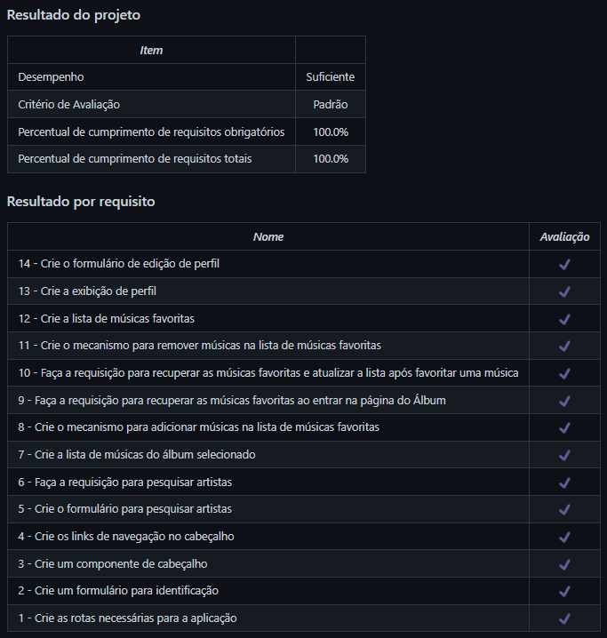

# TrybeTunes
Projeto da [Trybe](https://www.betrybe.com/) - Bloco 12 - Aplicação de streaming de música feito em React, utilizando métodos do ciclo de vida de componentes e React Router.

## 💻 Projeto

Aplicação de streaming de música com diversas funcionalidades, como:

- Fazer login;
- Pesquisar por uma banda ou artista;
- Listar os álbuns disponíveis dessa banda ou artista;
- Visualizar e reproduzir uma prévia das músicas de um álbum selecionado;
- Favoritar e desfavoritar músicas;
- Ver a lista de músicas favoritas;
- Ver e editar o perfil da pessoa logada.

<details>
  <summary><strong>🏆 Meu desempenho</strong></summary><br />

  
</details>

## 🚀 Tecnologias
> Este projeto foi desenvolvido com as seguintes tecnologias:

- JavaScript
- React
- React Router

## 📌 Habilidades

> Neste projeto, desenvolvi as seguintes habilidades:

- Fazer requisições e consumir dados vindos de uma API;
- Utilizar os ciclos de vida de um componente React;
- Criar rotas com o React Router, utilizando os componentes BrowserRouter, Switch, Route, Redirect e Link;
- Utilizar a função setState de forma a garantir que um determinado código só seja executado após o estado ser atualizado.

## ⬇️ Instalando dependências

```bash
npm install
``` 

## ⚡ Executando a aplicação

```bash
npm start
``` 

## 🧪 Executando os testes

```bash
npm test
```

## 💬 Contatos

<div align="center" style="display: inline_block">
  <a href="https://julianoboese.github.io" target="_blank"></a> 
  <a href="https://www.linkedin.com/in/julianoboese" target="_blank"></a> 
  <a href = "mailto:juliano.boese@gmail.com"></a>
</div>

<!-- ## 📄 Licença

Esse projeto está sob licença. Veja o arquivo [LICENÇA](LICENSE.md) para mais detalhes.

[⬆ Voltar ao topo](#nome-do-projeto)<br> -->
